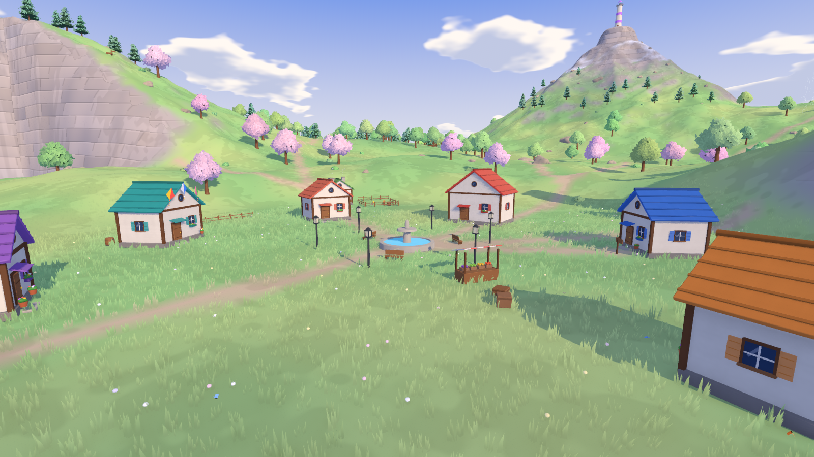
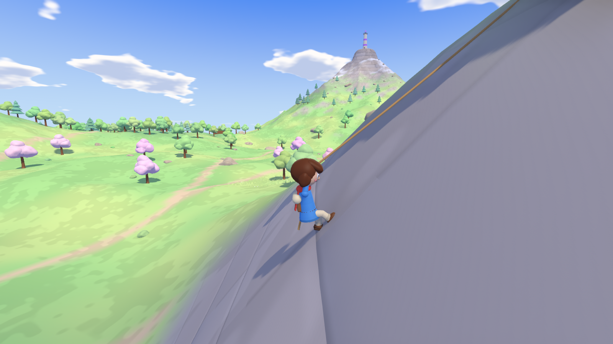
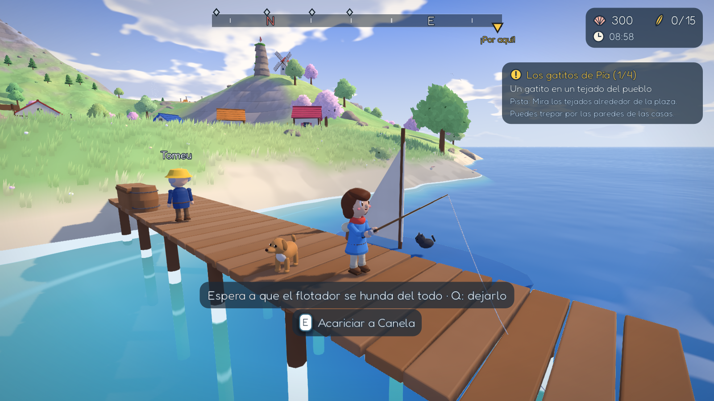
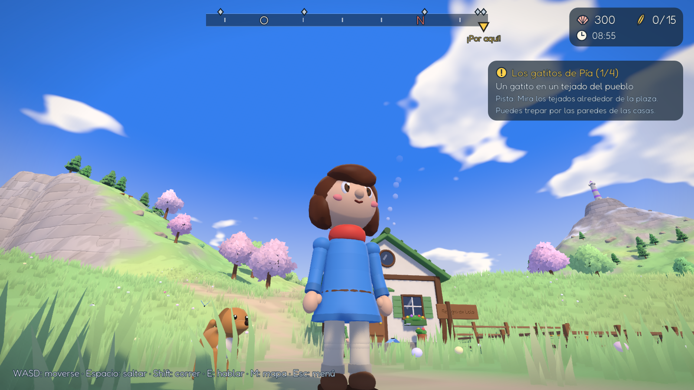
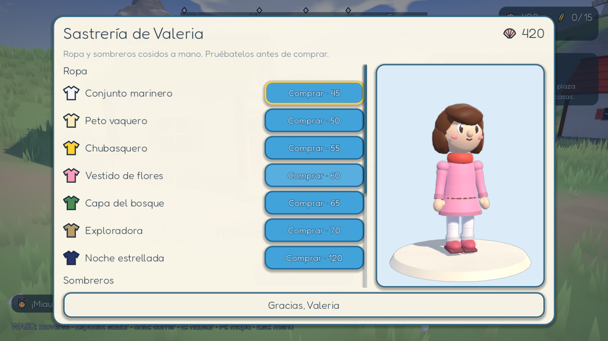
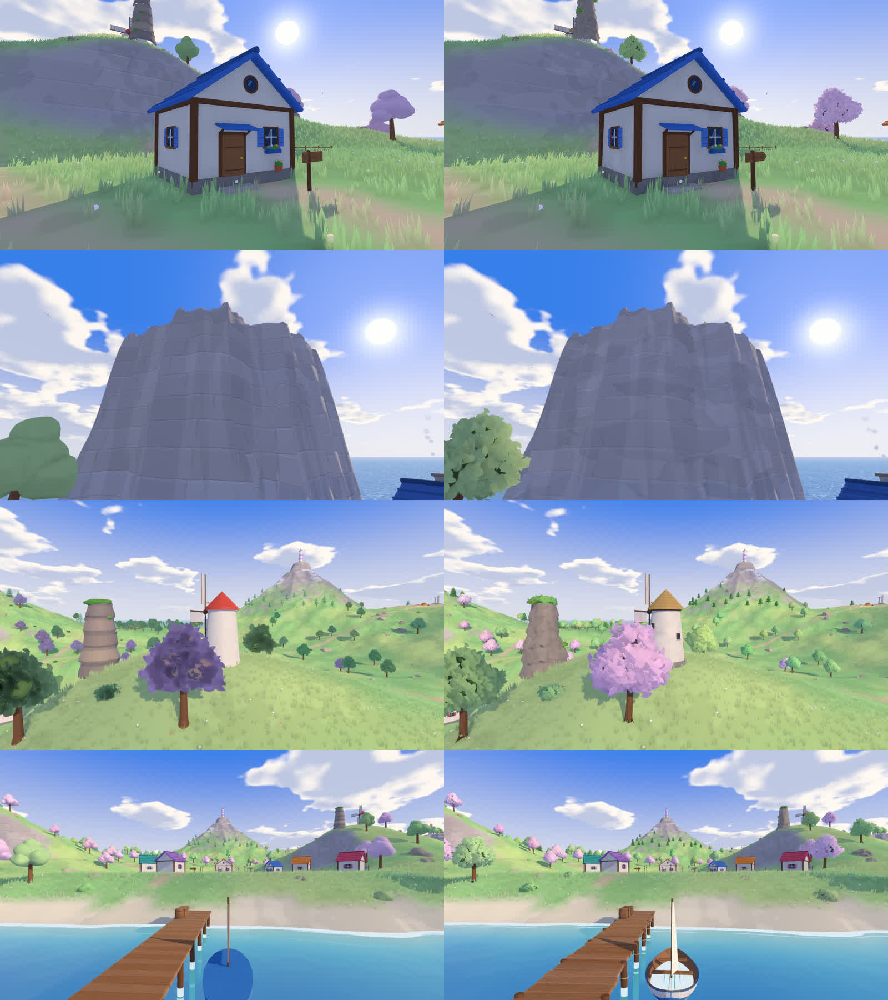

# Isla Brisa

Aventura de exploración en mundo abierto con un estilo pictórico suave (sombreado sin contornos, follaje de hojas, mar con reflejos), hecha con Godot 4.7.

Lía llega en barca a Isla Brisa, la isla de su abuela Olga, y se encuentra el aire completamente quieto: los cinco Faros del Viento se han apagado. Explora la isla con total libertad: corre, escala cualquier pared, planea con la paravela, nada, habla con los vecinos y vuelve a encender los faros para que regrese el viento.



| | |
|---|---|
|  |  |
|  |  |

Tráiler: [docs/trailer.mp4](docs/trailer.mp4)

**Antes y después** de quitar lo geométrico (materiales con relieve, biseles, rocas talladas, barca de verdad):



## Cómo se juega

| Acción | Teclado y ratón | Mando |
|---|---|---|
| Moverse | WASD o flechas | Stick izquierdo |
| Cámara | Ratón (rueda: acercar/alejar) | Stick derecho |
| Saltar · abrir/cerrar la paravela en el aire | Espacio | A |
| Correr (gasta aguante) | Shift | B |
| Hablar / usar / abrir | E | X |
| Soltarse al escalar | Q | Y |
| Mapa y menú | M / Esc | Back / Start |
| Diario de encargos | J | — |

- **Escalar:** camina contra una pared empinada (acantilados, rocas, casas, faros...). Lía lanza su gancho al borde (o lo clava en la roca si la pared es muy alta) y trepa por la cuerda con los pies contra la pared; al llegar arriba recoge la cuerda y se encarama. Espacio da un tirón fuerte hacia arriba; Atrás + Espacio salta hacia atrás.
- **Planear:** con la paravela, pulsa Espacio en el aire. Las corrientes de aire ascendentes (Peñón del Salto y pie de las ruinas) te suben muy alto.
- **Aguante:** el círculo verde junto a Lía. Escalar, correr, planear y nadar lo gastan, y en tierra se recupera. Si se vacía, Lía queda agotada hasta que se rellene. Cada **pluma dorada** añade un segmento (empiezas con 3 y hay 15 plumas).
- **Día y noche:** un día dura 20 minutos. De noche se encienden las farolas y las ventanas, brillan las setas del bosque y salen luciérnagas. **Siéntate en un banco** (E) para descansar: el tiempo pasa muy deprisa y recuperas el aguante.
- **Pesca:** Tomeu te regala una caña. Mira hacia el agua (orilla, muelle o lago) y pulsa E. Los mordisqueos son falsas alarmas: espera a que el flotador se hunda del todo y pulsa E; luego mantén E para recoger y suelta cuando la tensión suba, o se romperá el sedal. Hay 9 especies según el sitio y la hora (al amanecer y al atardecer pican antes). Tomeu te compra lo que pesques, y si consigues todas, te da su bufanda dorada.

## Historia y encargos

1. **Llegada:** Tomeu te recibe en el muelle y te manda a ver a la alcaldesa Rosa.
2. **La paravela perdida:** Nerea perdió su paravela en lo alto de la Roca Aguja, junto al molino. Escálala y devuélvesela.
3. **Los Faros del Viento** (en el orden que quieras):
   - **Faro del Acantilado:** escala la pared del Acantilado del Este.
   - **Faro del Bosque:** reúne 3 chispas de fuego (islote del lago, pila de piedras de la costa oeste y tocón gigante).
   - **Faro del Islote:** planea desde el Peñón del Salto hasta el islote en mitad del mar.
   - **Faro de las Ruinas:** supera la Carrera del Viento (8 anillos en 48 s).
4. **El Gran Faro:** con los cuatro encendidos, sube al Pico Brisa y enciende el último. Luego puedes seguir explorando.

Cada faro encendido da una pluma dorada y devuelve un poco de viento: la hierba se mueve más, el molino gira y las veletas giran.

**Encargos secundarios:**
- **Correo urgente (Bruno):** reparte tres cartas.
- **Los gatitos de Pía:** encuentra cuatro gatitos.
- **Setas brillantes (Ulises):** recoge cinco setas en el Bosque Susurro.

**Coleccionables:**
- 70 conchas en las playas.
- 8 cofres.
- 12 lugares por descubrir.

**Dinero (conchas):** se encuentran en las playas y en los cofres, y además:
- Cada encargo terminado y cada faro encendido dan una recompensa en conchas.
- **Repartos de Correos:** al terminar el encargo de Bruno, puedes pedirle paquetes cuando quieras. Llévalos al vecino que te diga; cuanto más lejos, más propina (10-32 conchas).
- **Carrera del Viento:** se puede repetir; cada victoria paga y batir el récord da un extra.
- **Tu mascota** escarba de vez en cuando mientras exploras y encuentra conchas.
- **Pesca:** Tomeu paga de 1 a 120 conchas por pieza (la Brisa dorada es la más valiosa).

**Tiendas del pueblo** (todas con probador 3D: pasa el ratón por un objeto para verlo puesto antes de comprar):
- **Puesto de Marisol:** bufandas, paravelas, una pluma dorada y la *brújula de plumas*, que señala la pluma más cercana.
- **Sastrería de Valeria** (casa del tejado frambuesa, con el tendedero): conjuntos de ropa (marinero, peto vaquero, chubasquero, vestido de flores, capa del bosque, exploradora, noche estrellada) y sombreros (paja, boina, gorra, gorro de lana, corona de flores, gorro marinero).
- **Refugio de Lola** (casa del tejado verde, con el cercado de animales): adopta a Pipo el pollito, Algodón el conejo, Miso el gato, Canela la perrita, Brasa la zorrita o Kiwi el loro. La mascota te sigue a todas partes (el loro vuela y se te posa en el hombro); acércate y pulsa E para acariciarla.

La ropa, la paravela y la mascota se cambian en *Esc → Aspecto*.

**Guardado automático:** se guardan la posición, la hora, la historia, los objetos y los ajustes, en `%APPDATA%\Godot\app_userdata\Isla Brisa\isla_brisa_save.json`.

## Ejecutar

Doble clic en `dist\windows\IslaBrisa.exe` (el `.pck` tiene que estar al lado). Desde el código:

```powershell
& "..\project-night-shift\.tools\Godot_v4.7.1-stable_mono_win64\Godot_v4.7.1-stable_mono_win64.exe" --path .
```

Para volver a exportar:

```powershell
& "<godot>_console.exe" --headless --path . --export-release "Windows x64" dist/windows/IslaBrisa.exe
```

## Pruebas y herramientas

```powershell
python tools/check.py                                     # compila todos los scripts
& "<godot>_console.exe" --headless --path . -- --ib-test  # 258 comprobaciones: isla, objetos, historia, tiendas, dinero, mascotas, pesca, guardado y movimiento
& "<godot>_console.exe" --path . -- --ib-capture          # capturas de todas las pantallas en captures/ (también tiendas y mascota)
& "<godot>_console.exe" --path . -- --ib-look [--hour=21] [--only=village,forest]  # vistas del mundo y de los personajes
& "<godot>_console.exe" --path . -- --ib-move             # pruebas de movimiento con capturas
& "<godot>_console.exe" --path . -- --ib-items            # una captura por objeto; luego: python tools/contact_sheet.py
& "<godot>_console.exe" --headless --path . --script res://tools/preview_map.gd   # mapa cenital en captures/
python tools/make_audio.py                                # regenera música y efectos (unos 2,5 min)
```

Las pruebas de movimiento usan un piloto automático que juega de verdad con la física del juego. Comprueban que:
- Se escala la Roca Aguja con el aguante inicial.
- Se llega planeando del Peñón al islote.
- Se sube al tejado de Pía.
- Se gana la Carrera del Viento a tiempo.

## Estructura

| Ruta | Contenido |
|---|---|
| `scripts/main.gd` | Flujo: título, partida, diálogos, menús, escenas de los faros, final, música y ambiente |
| `scripts/world/island.gd` | Generación de la isla: relieve, biomas, colores, caminos y consultas de altura |
| `scripts/world/terrain_view.gd` | Malla del terreno por trozos, colisión de mapa de alturas, mar y lago |
| `scripts/world/sky_cycle.gd` | Ciclo de día y noche, sol/luna, niebla y uniformes globales |
| `scripts/world/flora.gd` | Árboles, pinos, arbustos y rocas (MultiMesh), y hierba y flores en trozos alrededor del jugador |
| `scripts/world/places.gd` | Pueblo, muelle, molino, faros, ruinas, campamentos, corrientes de aire y anclas |
| `scripts/world/props.gd`, `mesh_kit.gd` | Modelos y materiales procedurales |
| `scripts/player/player.gd` | Controlador de Lía: correr, saltar, escalar con gancho, encaramarse, planear y nadar |
| `scripts/player/climb_gear.gd` | Gancho y cuerda de escalada (lanzamiento, cuerda tensa, recogida) |
| `scripts/player/avatar.gd` | Modelo (con codos y rodillas) y animación procedural de Lía y de los vecinos |
| `scripts/game/pet.gd` | Mascotas: modelos, seguimiento, nado, vuelo del loro y hallazgo de conchas |
| `scripts/game/fishing.gd` | Pesca: caña, flotador, sedal, minijuego de tensión y modelos de los peces |
| `scripts/player/cam_rig.gd` | Cámara en tercera persona |
| `scripts/game/gameplay.gd` | Vecinos, diálogos, coleccionables, cofres, faros, carrera y encargos |
| `scripts/game/catalog.gd` | Datos: vecinos, plumas, cofres, gatitos, setas, chispas y tienda |
| `scripts/ui/` | HUD, aguante, brújula, diálogos, mapa, menús, tiendas y probador 3D (`fitting_room.gd`) |
| `shaders/` | Sombreado suave con materiales procedurales y relieve (madera, piedra, enlucido, tejas, corteza, paja, tela y pelo), terreno con estratos de roca, hierba, follaje de hojas, llamas, agua y cielo |
| `tools/` | Comprobación, capturas, vista del mapa y sintetizador de audio |

## Créditos

- Tipografía [Fredoka](https://fonts.google.com/specimen/Fredoka), con licencia SIL Open Font License (`assets/fonts/OFL.txt`).
- Todo lo demás es original de este proyecto: código, isla y modelos procedurales, shaders, música y efectos sintetizados.
